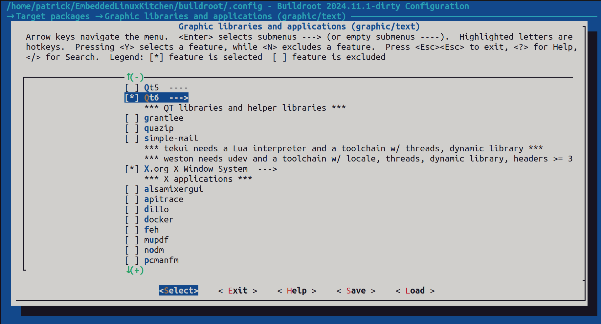
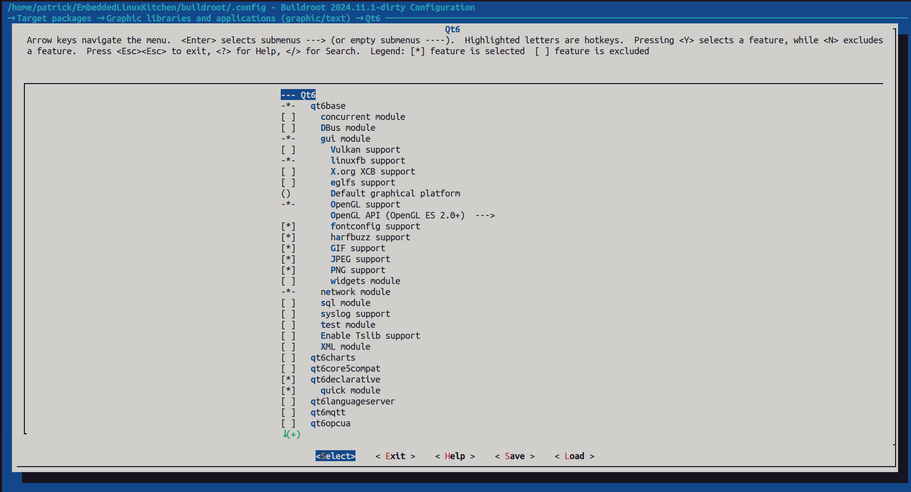
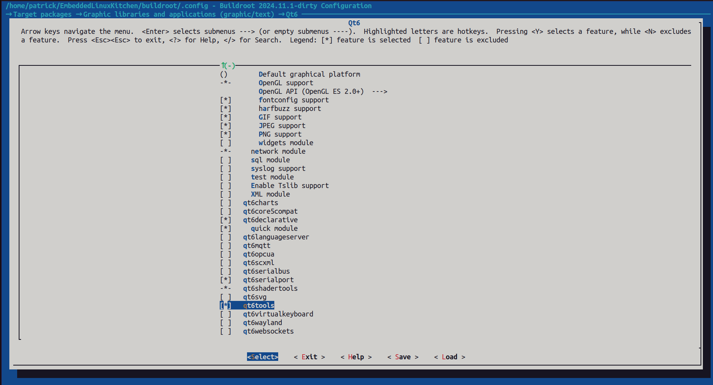
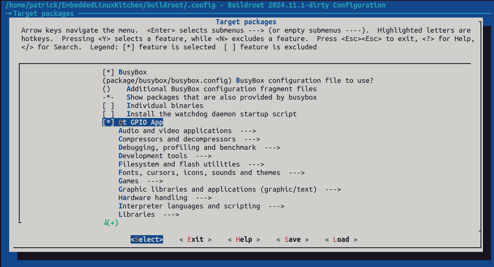
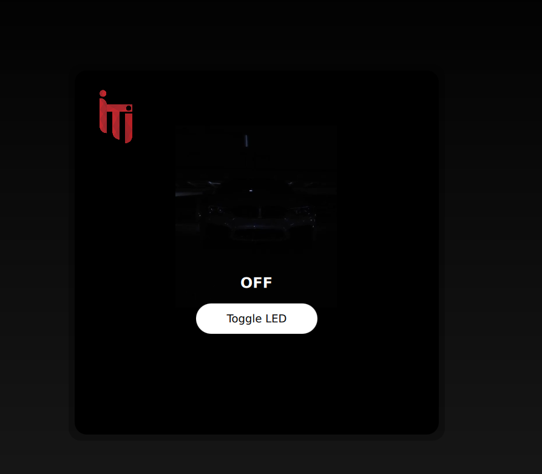
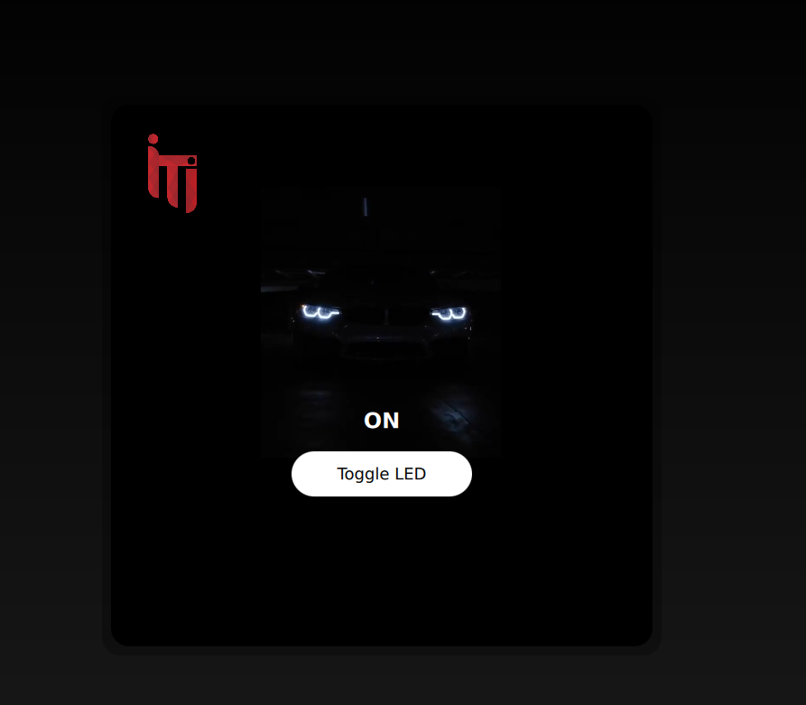

# Qt6 LED Control Application for Raspberry Pi 3B+

## Project Overview
This project is a Qt6-based graphical user interface (GUI) application designed to control an LED on a Raspberry Pi 3B+ using GPIO. The application is implemented using Qt Quick (QML) for the frontend and C++ for backend logic. The system runs on a custom Buildroot-based Linux distribution.

## Features
- Simple and elegant GUI for LED control
- Uses Qt Quick (QML) for UI design
- Interacts with Raspberry Pi's GPIO via C++ backend
- Cross-compiled for ARM64 architecture using Buildroot

---

## Getting Started

### 1. Clone Buildroot Repository
```sh
git clone git@github.com:buildroot/buildroot.git
```

### 2. Checkout the Required Branch
```sh
cd buildroot
git checkout 2024.11.1
```

### 3. Select Raspberry Pi 3B+ Configuration
```sh
cd buildroot/configs
ls | grep raspberrypi
```
Choose the configuration:
```sh
make raspberrypi3_64_defconfig
```

### 4. Configure Buildroot
Run the configuration menu:
```sh
make menuconfig
```
Make the following selections:
1. Navigate to **Target Packages → [*] QT GPIO APP**
   - This will be shown after step no.6 do the step and re-type make menuconfig then this option will appear, enable it.
2. Under **Graphic Libraries and Applications**, enable Qt6:
   - Fontconfig support
   - Harfbuzz support
   - GIF, JPEG, PNG support
   - X.org XCB support (optional)
   - Qt6 Declarative (for QML)
   - Qt6 SerialPort
   - Qt6 Tools

   ### menuconfig 
   
   1-
   
   2-
   
   3-
   


### 5. Create the Qt Application Package
Under `package/`, create the directory:
```sh
mkdir package/qt-gpio-app
cd package/qt-gpio-app
```
Ensure the directory has the following structure:
```
qt-gpio-app/
├── CMakeLists.txt
├── Config.in
├── main.qml
├── qt-gpio-app.mk
└── src/
    ├── controller.cpp
    ├── controller.h
    └── main.cpp
```

### 6. Modify Buildroot Configuration
Edit `package/Config.in` to include:
```sh
source "package/qt-gpio-app/Config.in"
```
This ensures Buildroot recognizes our custom package, Include it under Target packages menu.
**Now it's here**
   

### 7. Build the System
Run:
```sh
make -j12
```
This compiles the Qt application and the entire Buildroot system.

---

## Preparing the SD Card

### 1. Flash Buildroot Image
```sh
sudo dd if=buildroot/output/images/sdcard.img of=/dev/mmcblk0 bs=4M status=progress && sync
```

### 2. Mount Root Filesystem
After flashing, unmount any automatically mounted partitions and manually mount the root filesystem:
```sh
sudo mount /dev/mmcblk0p2 ~/sdcard/rootfs
```

### 3. Ensure QML Image Resources are Available
```sh
cd ~/sdcard/rootfs/usr/share
sudo mkdir qt-gpio-app
cd qt-gpio-app
sudo touch main.qml  # (This may not be necessary but included as a precaution)
sudo cp ~/car2on.png .
sudo cp ~/car2off.png .
sudo cp ~/itilogo.png .
cd ~
```

### 4. Unmount the Root Filesystem
```sh
sudo umount ~/sdcard/rootfs
```
Now the SD card is ready.

---

## Running the Application on Raspberry Pi

### 1. Insert the SD Card and Connect Peripherals
- Insert the prepared SD card into the Raspberry Pi.
- Connect an HDMI cable from the Raspberry Pi to a TV or monitor.
- Connect the LED circuit to the appropriate GPIO pins.
- Power on the Raspberry Pi.

### 2. Log In to Buildroot
Once the system boots, log in:
```
Buildroot login: root
```

### 3. Run the Qt Application
```sh
cd /usr/bin
./qt-gpio-app -platform linuxfb
```

Now the application should launch, allowing LED control via the GUI.

---

## Code Explanation

### **1. Frontend (QML) - `main.qml`**
This file defines the GUI:
- A button to toggle the LED
- An image to display the LED status
- Uses `controller.toggleLED()` to communicate with the backend

### Final QML Result





### **2. Backend (C++ Controller) - `controller.h` & `controller.cpp`**
- Controls GPIO using `/sys/class/gpio`
- Reads and writes to GPIO value files
- Uses Qt’s `QObject` and `Q_INVOKABLE` to expose methods to QML

### **3. CMake Build System - `CMakeLists.txt`**
- Finds Qt6 components
- Compiles the Qt application
- Installs binaries and QML files to appropriate locations

### **4. Buildroot Integration - `qt-gpio-app.mk`**
- Defines the package version and dependencies
- Configures CMake for cross-compilation
- Installs the binary to `/usr/bin`

---

## Frontend-Backend Communication
The frontend (QML) communicates with the backend (C++ controller) using Qt’s **signals and slots** mechanism:

### **1. Context Property Binding**
In `main.cpp`, the `Controller` object is registered as a context property:
```cpp
engine.rootContext()->setContextProperty("controller", &controller);
```
This allows the QML frontend to directly call functions from the `Controller` class.

### **2. Q_INVOKABLE Method**
The `toggleLED()` method in `controller.h` is marked as `Q_INVOKABLE`:
```cpp
Q_INVOKABLE void toggleLED();
```
This makes it callable from QML.

### **3. Calling Backend from Frontend**
In `main.qml`, the button’s `onClicked` event calls the backend method:
```qml
onClicked: {
    controller.toggleLED()
}
```
This invokes the C++ method `toggleLED()`, which:
- Reads the current GPIO value
- Toggles it between `0` and `1`
- Updates the LED state in the system

### **4. Updating the UI**
Since the LED state is toggled in C++, the UI can be updated accordingly by reading the GPIO state before setting the `ledImage.source` in QML.

---

## Conclusion
This project demonstrates how to use Qt6 and Buildroot to develop an embedded Linux application for Raspberry Pi, integrating GUI development with hardware control. 🚀

### Final Video Result 

https://github.com/user-attachments/assets/25eb5c50-022d-4361-812b-1e3c01d09d1e
